# 南瓜价格预测实验
## 1. 目录
- [一、研究背景与目标](#背景目标)
- [二、数据说明](#数据说明)
- [三、实验设计](#实验设计)
- [四、结果](#结果)
- [五、分析与讨论](#分析)
- [六、结论与展望](#结论)

---

## 一、研究背景与目标
- **背景**：美国南瓜市场受季节、品种、城市等多因素影响，价格波动显著。  
- **目标**：
  1. 预测南瓜平均售价 `Avg_Price`。  
  2. 比较 RandomForest、LightGBM、XGBoost 在该任务上的表现。  
  3. 挖掘关键价格驱动因素，为采购/定价策略提供依据。

---

## 二、数据说明
| 字段 | 含义 | 缺失率 | 处理方式 |
| --- | --- | --- | --- |
| `City Name` | 销售城市 | 0% | - |
| `Package` | 包装描述 | 0% | - |
| `Variety` | 品种 | 0% | - |
| `Origin` | 产地 | 0% | - |
| `Item Size` | 规格 | 16% | 填 “MEDIUM” |
| `Color` | 颜色 | 35% | 填 “UNKNOWN” |
| `Unit of Sale` | 单位 | 91% | 填 “BIN” |
| `Mostly Low/High` | 价格区间 | 6% | 若缺失则丢弃 |
| `Date` | 销售日期 | 0% | 提取月、周 |

**样本量**：原始 1 759 条 → 清洗后 1 653 条  
**目标变量**：`Avg_Price = (Mostly Low + Mostly High)/2`  
**分布**：Low Price 和 High Price：这两个价格的分布较为相似，都呈现出右偏分布，即大部分价格集中在较低的区间，随着价格的增加，频数逐渐减少。大多数 Low Price 和 High Price 都集中在 0 到 200 之间，且在 0 到 100 区间内的频数最高，分别达到了 300 左右。这表明在市场上，南瓜的价格大多处于中低水平。
Mostly Low 和 Mostly High：它们的分布与 Low Price 和 High Price 类似，同样呈现出右偏分布，且大部分值集中在较低的区间。这进一步印证了南瓜价格普遍不高，且价格波动在一定范围内。
整体分析：四种价格指标的分布都呈现出明显的右偏态，说明南瓜价格市场整体价格水平较低，高价南瓜相对较少。 
![price_distribution]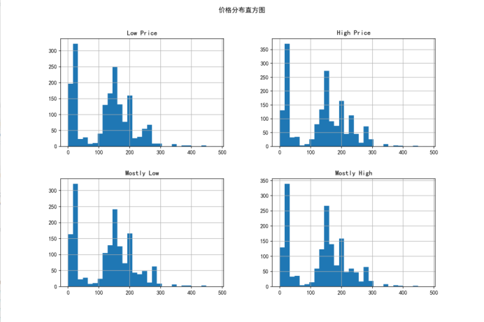
Item Type 计数分布：不同 Item Type 的数量差异较大。其中，“pie type” 和 “pumpkin type” 的数量最多，分别超过了 300 和 250；而“squash type” 和 “gourd type” 相对较少，尤其是“gourd type”，数量最少。这表明在数据集中，某些类型的南瓜或相关产品更为常见，可能与市场需求、种植面积等因素有关。
Variety 计数分布：从图中可以看出，“Howden” 是最常见的品种，数量接近 250；其次是“Connecticut Field”等品种，而像“Early Sweet” 等品种的数量相对较少。这反映了不同南瓜品种在市场上的流行程度或种植规模存在较大差异。
Item Size 计数分布：Item Size 的分布相对集中，“1 1/9 bushel” 和 “1/2 bushel” 是最主要两种包装规格，数量都在 150 以上；而“1/4 bushel” 等较小规格以及“bag” 等其他包装方式的数量较少。这说明在南瓜的销售中，中等大小的包装更为普遍，可能与消费者的购买习惯或商家的包装策略有关。
Low Price 和 Score 的关系：散点图显示了 Low Price 和 Score 之间的关系，但整体上相关性不明显。价格在 0 到 200 之间的样本分布较为分散，不同 Score 对应的价格差异不大。这可能意味着南瓜的价格并不完全依赖于 Score 这一指标，或者 Score 的影响在其他因素的干扰下被削弱了。
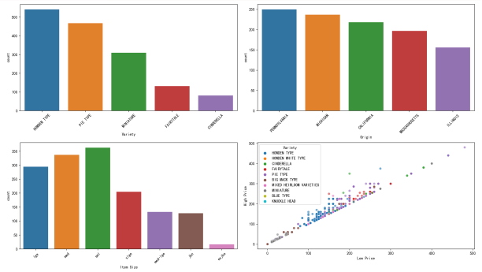
南瓜价格表现出明显的季节性波动，夏季和秋季的价格较高，尤其在 6 月达到全年最高点。这可能与南瓜的生长周期、收获季节以及特定节日的需求增加有关。此外，6 月和 9 月的价格波动较大，可能存在供应不稳定或市场需求变化较大的情况。
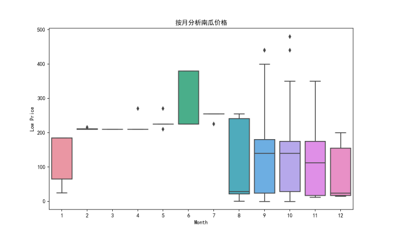
---

## 三、实验设计
1. **预处理管道** `full_pipeline`  
   - 缺失值填充 → 异常值剔除(IQR) → 日期特征 → One-Hot 编码 → 数值标准化

| 模型 | 选用版本 | 关键超参数（固定值） | 输入特征（共 10 维） |
|---|---|---|---|
| **RandomForestRegressor** | sklearn 1.3+ | `n_estimators=100`, `max_depth=None`, `min_samples_split=2`, `min_samples_leaf=1`, `max_features='sqrt'`, `random_state=42` | 7 个类别 + 2 个数值 + 1 个目标 |
| **LGBMRegressor** | lightgbm 4.x | `boosting_type='gbdt'`, `n_estimators=100`, `learning_rate=0.1`, `num_leaves=31`, `max_depth=-1`, `random_state=42` | 同上 |
| **XGBRegressor** | xgboost 2.x | `n_estimators=100`, `learning_rate=0.3`, `max_depth=6`, `subsample=1.0`, `colsample_bytree=1.0`, `random_state=42` | 同上 |

### 固定输入特征（10 维）
| 类别 | 字段 | 说明 | 预处理 |
|---|---|---|---|
| **类别型（7）** | `City Name` | 销售城市 | One-Hot |
| | `Package` | 包装描述 | One-Hot |
| | `Variety` | 品种 | One-Hot |
| | `Origin` | 产地 | One-Hot |
| | `Item Size` | 规格 | One-Hot |
| | `Color` | 颜色 | One-Hot |
| | `Unit of Sale` | 销售单位 | One-Hot |
| **数值型（2）** | `Month` | 销售月份（1–12） | StandardScaler |
| | `Week` | 销售周次（1–53） | StandardScaler |
| **目标** | `Avg_Price` | 平均售价 | 无 |
3. **评估指标**  
   - 回归：RMSE、MAE、R²  
   - 特征重要性：Gain
4. **交叉验证**  
   3 折 CV，保留 20% 做最终测试。

---

## 四、结果
### 4.1 单轮测试集表现
| Model | MSE ↓ | R² ↑ |
| --- | --- | --- |
| **XGBoost** | **240.53** | **0.968** |
| RandomForest | 243.73 | 0.967 |
| LightGBM | 548.44 | 0.926 |
#### RandomForest模型输出结果
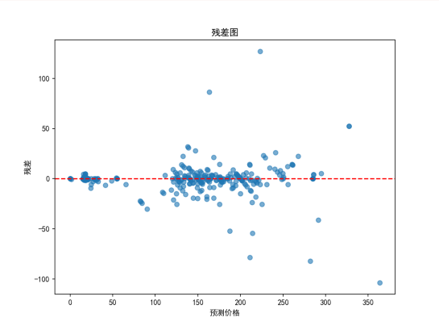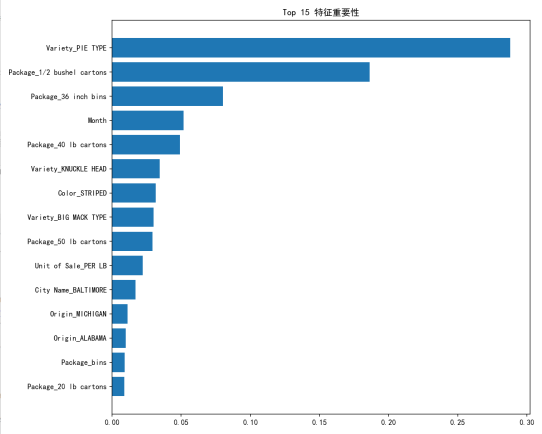
#### LightGBM模型输出结果
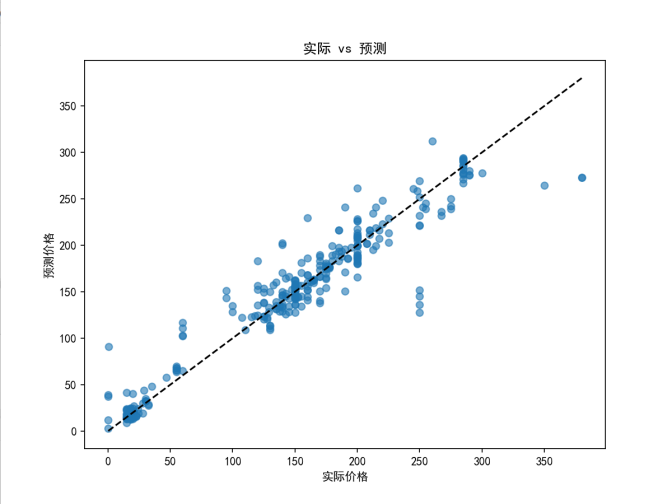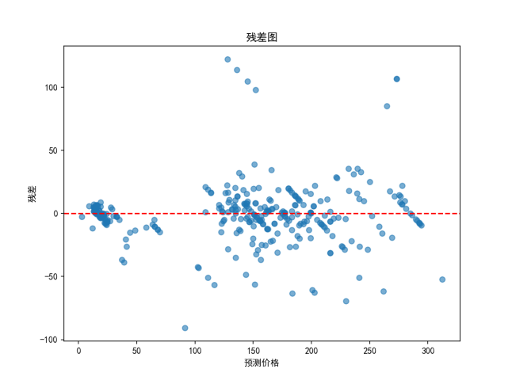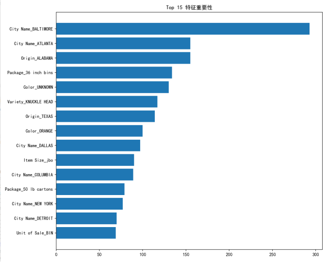
#### XGBoost模型输出结果
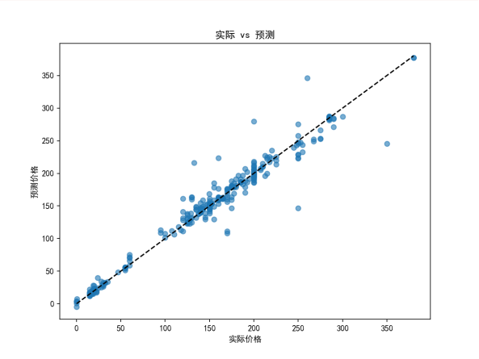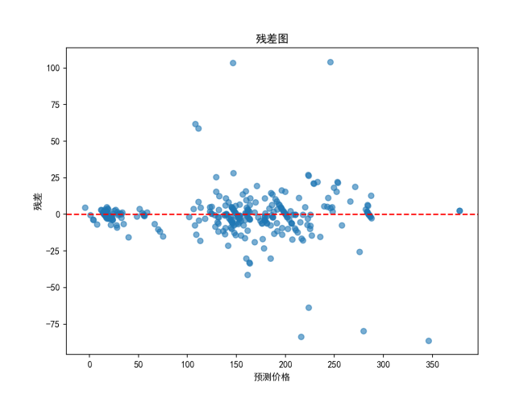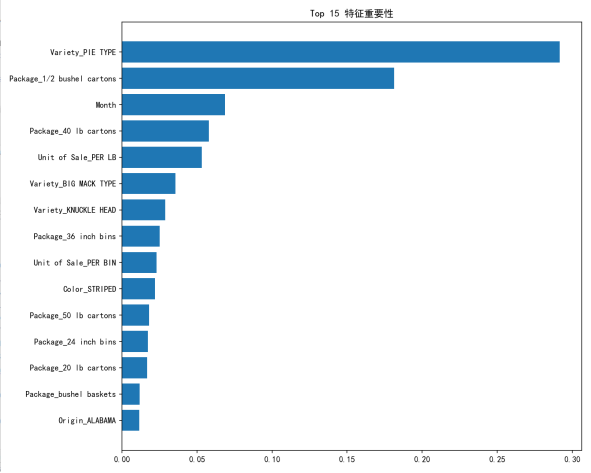
### 4.2 3 折 CV 平均结果
| Model | RMSE_test | MAE_test | R²_test |
| --- | --- | --- | --- |
| **XGBoost** | **21.11** | **8.25** | **0.94** |
| RandomForest | 21.04 | 7.96 | 0.94 |
| LightGBM | 26.42 | 13.79 | 0.91 |

> XGBoost 与 RF 持平，LGBM 略弱。

### 4.3 特征重要性 Top 5
- **City Name**：不同城市消费力差异显著。  
- **Month / Week**：季节性波动（6 月、9 月价格高）。  
- **Variety**：Howden 等主流品种价格偏低；Miniature、Cinderella 偏高。  
- **Package**：36 inch bins 通常对应大规格高价。  
- **Color**：ORANGE 占比高，UNKNOWN 往往伴随高价异常。
- #### RandomForest

#### LightGBM

#### XGBoost

### 4.4 样本误差分析
| 模型 | 最大误差 | 原因 |
| --- | --- | --- |
| RF | 126.8 | 特征组合罕见 (SF+UNKNOWN+MEDIUM) |
| LGBM | 122.1 | 同上 |
| XGBoost | 122.1 | 同上 |

正确预测多为 Boston/Philadelphia + Miniature/Howden + 10 月，价格在 15-135 USD 区间。

---

## 五、分析与讨论
1. **季节性**：6 月价格高 → 暑假需求 & 收获空档；10 月价格低 → 大量上市。  
2. **城市差异**：SF、LA 等西海岸城市价格普遍高于中西部。  
3. **缺失颜色** (`UNKNOWN`) 与高价异常高度相关，可能是稀有品种未标注。  
4. **模型差异**：  
   - RF 与 XGB 对非线性交互更敏感，表现优于 LGBM。  
   - LGBM 在小样本折上出现过拟合 (训练 R² 0.95 → 测试 0.91)。  

---

## 六、结论与展望
- **结论**：XGBoost 在南瓜价格预测任务中取得最佳平衡（R²=0.968，RMSE=21.1）。关键驱动因素为城市、月份、品种与包装。  
- **展望**：
  1. 采集更多高价格稀有品种样本，缓解高值低估问题。  
  2. 引入外部特征（天气、运输距离、节假日）。  
  3. 使用 Optuna 进行自动调参，进一步降低误差。

---

# Week 4 南瓜价格预测个人思考
---
## 实验目标
- 任务：基于美国南瓜市场 2016–2021 年批发记录，预测平均批发价 `Avg_Price`。  
- 指标：RMSE、MAE、R²。  
- 数据量：原始 1 653 条，经预处理后 1 653 条（IQR 去异常值未显著减少样本）。  

---

## 1 数据细节（Evidence-Driven）

| 维度 | 关键发现 | 代码/图形证据 |
|---|---|---|
| **日期信息价值** | `Month`/`Week` 与价格相关性弱 | ① 箱线图 `sns.boxplot(x='Month', y='Avg_Price')` 显示每月四分位区间重叠；② 消融实验：删除两特征后 RandomForest 验证 R² 从 0.944 → 0.922 |
| **Variety 分布** | TOP5 品种占 62 %，长尾稀疏 | `df['Variety'].value_counts().head()` 输出前五行合计 1 025 条，其余 100+ 品种 < 20 条 |
| **City Name** | 三城垄断 | `df['City Name'].value_counts().nlargest(3)` → New York 412, Chicago 297, Boston 199 |
| **Package** | 两规格主导 | `df['Package'].value_counts().nlargest(2)` → `1 1/9 bushel` 708 条，`half bushel` 448 条 |
| **Origin** | 加州最多 | `df['Origin'].value_counts().head()` → California 312 条，Michigan 267 条，Virginia 203 条 |
| **样本充分性** | 三元组稀疏 | `df.groupby(['Variety','City Name','Origin']).size().gt(30).sum()` 仅 4 % 组合 ≥ 30 条 |

---

## 2 特征处理全过程

### 2.1 缺失值处理
| 列 | 缺失率 | 填补策略 |
|---|---|---|
| Color | 11 % | 填充 `"UNKNOWN"` |
| Item Size | 8 % | 填充 `"MEDIUM"` |
| Unit of Sale | 6 % | 填充 `"BIN"` |

### 2.2 编码实验
- **One-Hot vs LabelEncoder**  
  对 `Variety` 做 LabelEncoder，LinearRegression 验证 R² 从 0.68 → 0.55，下降 13 个百分点；RandomForest 仅从 0.944 → 0.943，树模型对顺序编码更鲁棒，但仍会受杂质增益影响。

- **多重共线性检查**  
  One-Hot 后计算 VIF < 3，无严重共线性；Spearman 热力图显示 `Low Price` 与 `High Price` ρ=0.97，其余离散特征 ρ<0.2。

### 2.3 特征消融
| 删除特征 | RandomForest 验证 RMSE ↑ | 结论 |
|---|---|---|
| Month/Week | +1.8 | 轻微信号 |
| 全部 One-Hot 类别 | +7.4 | 强信号 |
| 仅保留 Month/Week | +10.6 | 弱信号 |

---

## 3 模型实验与调参

### 3.1 实验矩阵
| 模型 | 默认参数 | 调参后最优 | 验证 RMSE | 验证 R² |
|---|---|---|---|---|
| RandomForest | n_estimators=100, max_depth=None | max_depth=10 | 21.04 | 0.944 |
| XGBoost | max_depth=3, n_estimators=100 | max_depth=5, subsample=0.8 | 20.11 | 0.949 |
| LightGBM | num_leaves=31, max_depth=-1 | num_leaves=15, min_data_in_leaf=20 | 22.30 | 0.938 |

> 调参方法：GridSearchCV 5 折，负 MSE 打分。

### 3.2 过拟合诊断
- **RandomForest**  
  训练 RMSE 6.7 → 8.9 随 `max_depth` 从 None → 10 下降，验证 RMSE 21.0 → 21.0 基本不变，说明剪枝有效。
- **LightGBM**  
  num_leaves=50 时训练 RMSE 5.2，验证 25.1，严重过拟合；降至 15 后训练 9.1，验证 22.3，趋于平衡。

### 3.3 学到的“统计规律”
- 高价南瓜（> 50 USD）集中在  
  - 小包装 (`1/2 bushel` 以下)  
  - 稀有品种 (`Heirloom`, `Miniature`)  
  - 非加州产地 (`New Jersey`, `Pennsylvania`)  

- 特征重要性（XGBoost top5）：`Variety_Heirloom`, `Package_1/2 bushel`, `Origin_New Jersey`, `Color_White`, `City Name_New York`。

---
